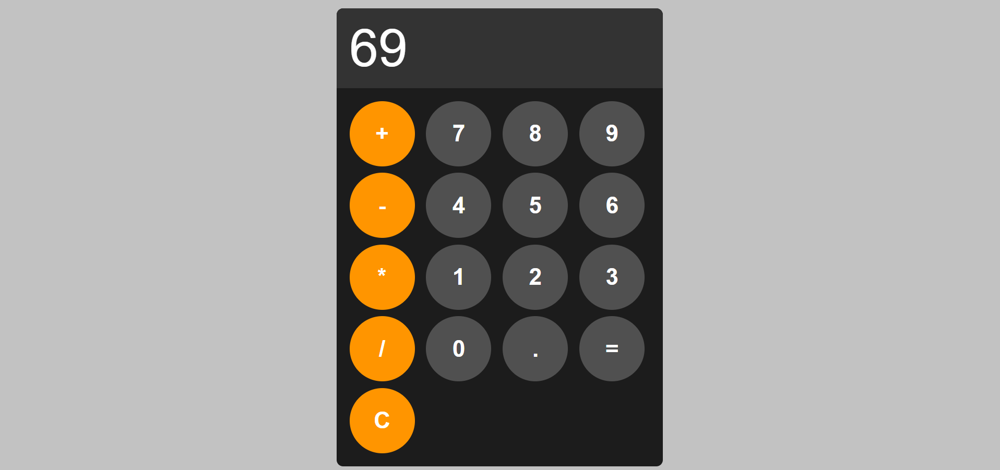

# Calculator

🍏 Apple Calculator Clone
A clean and functional Apple-style calculator built with HTML, CSS, and JavaScript. This project recreates the look and feel of the iOS calculator app with basic arithmetic functionalities.

✨ Features
- Basic arithmetic operations (addition, subtraction, multiplication, division)
- Simple and intuitive UI inspired by Apple's calculator
- Smooth button animations and transitions
- Clean code structure for easy understanding and future improvements
🛠️ Tech Stack
- HTML5 for structure
- CSS3 for styling and layout
- Vanilla JavaScript for calculator logic
